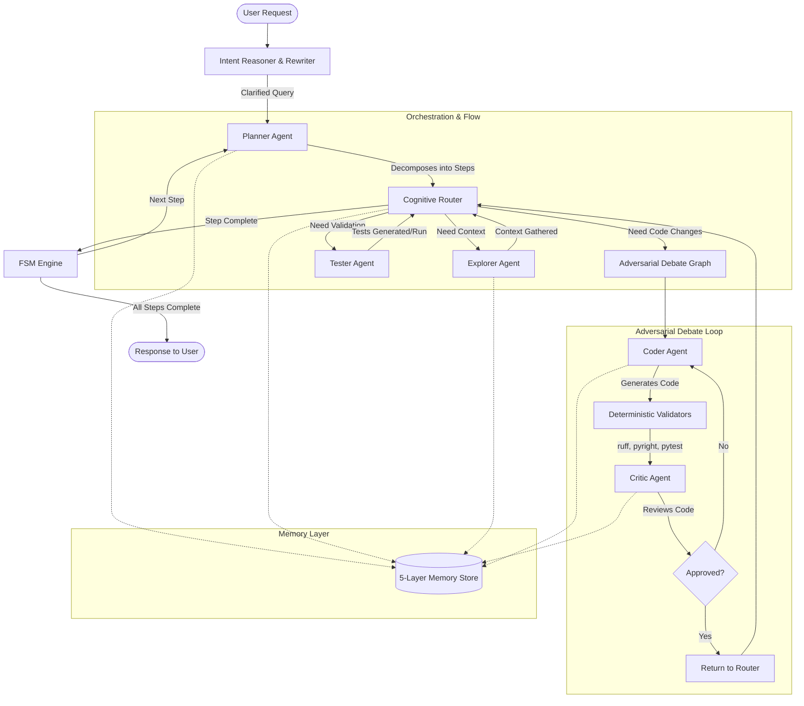

# ChotoVai-Agent Architecture

The **SLM-First Coding Agent** system is designed to scaffold Small Language Models (SLMs) such as Qwen2.5-Coder 7B or Llama-3-8B into robust, agentic systems capable of handling complex software engineering tasks. Since SLMs have limited context windows and reasoning capabilities compared to frontier models, this architecture relies heavily on structured state, deterministic feedback, and multi-agent adversarial debate.

## Architecture Diagram

## Core Philosophical Tenets

1. **Deterministic over Probabilistic**: Use SLMs for generation, but use discrete compilers, linters, and test suites for validation.
2. **Adversarial Convergence**: Models review each other. A Coder generates, while an isolated Critic evaluates against rules and tests.
3. **Hierarchical Memory**: State limits context bloat. Only the exact components needed by an agent are pulled into its working memory context.

## System Components

### 1. Agents Swarm (`src/agents/`)
Specialized agent nodes built on top of a common `BaseAgent`. Each agent is responsible for an isolated functional domain:
- **Coder (`coder.py`)**: Responsible for writing and editing source code. Takes carefully curated context from memory.
- **Critic (`critic.py`)**: Reviews generated code, acts as an SLM-as-a-Judge, and provides specific feedback to the Coder. Operates with explicit rubrics.
- **Tester (`tester.py`)**: Responsible for generating, running, and fixing unit tests to guarantee behavior.
- **Explorer (`explorer.py`)**: Navigates the repository, reads files, and builds domain context to avoid hallucinated paths.

### 2. Orchestration & Sub-Graphs (`src/orchestrator/`)
Manages the control flow between specialized components:
- **FSM (`fsm.py`)**: The primary Finite State Machine loop orchestrating top-level execution.
- **Intent Reasoner / Query Rewriter**: Intercepts the raw user query and uses a **Tree of Thoughts (ToT)** approach to evaluate multiple interpretations before rewriting the query for optimal system comprehension.
- **Planner (`planner.py`)**: Takes the rewritten query, drafts and evaluates multiple architectural approaches using **ToT**, and then deconstructs the best approach into a DAG of execution steps.
- **Cognitive Router (`cognitive_router.py`)**: Evaluates the current state and routes execution to the appropriate specialist agent (e.g., routing to Explorer if context is missing).
- **Debate Graph (`debate_graph.py`)**: A LangGraph-like cyclic loop between the Coder and the Critic. The Coder leverages **Graph of Thoughts (GoT)** to generate parallel candidate implementations, which the Critic evaluates and merges, ensuring code is iteratively refined until approved or an escalation limit is reached.
- **Escalation (`escalation.py`)**: Handles fallback strategies (like falling back to a frontier model via OpenRouter) when the adversarial loop stagnates.

### 3. Memory Structure (`src/memory/`)
A 5-layer state management system designed to protect the SLM's limited context window:
- **Working Buffer**: Ephemeral context for the current turn (e.g., immediate tool outputs, short thoughts).
- **Plan State**: Task decomposition and current progress.
- **Episodic Store**: Short-term RAG storage of past moves within the current session.
- **Semantic Store**: Global knowledge about the repository structure (powered by Qdrant).
- **Procedural Memory**: Fixed rules, tool definitions, and standard operating procedures.

### 4. Deterministic Validators (`src/validators/`)
Before SLMs are asked to judge success, the system executes code deterministically:
- `ruff`: Syntax and linting.
- `pyright`: Static type checking.
- `pytest`: Unit test execution.
The output of these validators is fed directly into the Coder/Critic debate loop.

### 5. Serving Layer (`src/serving/`)
An OpenAI-compatible abstraction layer designed to interface seamlessly with:
- Local instances of **vLLM** or **Ollama** for primary SLM inference.
- Remote proxies (e.g., OpenRouter) for larger fallback models during escalation.

### 6. Repository Intelligence (`src/repo_intel/`)
Advanced semantic and graph-based reasoning over the codebase:
- **GraphRAG & Code Graph (`graph_rag.py`, `code_graph.py`)**: Builds an abstract syntax tree and dependency graph representation of the codebase.
- **Community Detection (`community.py`)**: Identifies bounded contexts and microservice boundaries within monolithic repositories. 
- **RLM (`rlm.py`)**: Repository Language Modeling capabilities.

### 7. Continuous Improvement (`src/fine_tuning/`)
Leveraging the outputs of the adversarial debate for self-improvement:
- **Debate Collector (`debate_collector.py`)**: Harvests successful trajectories and code corrections from the Coder vs. Critic loops.
- **Imagine Trainer (`imagine_trainer.py`)**: Generates synthetic tasks based on the codebase to fine-tune the SLM via Reinforcement Learning, pushing the model's performance beyond its base capabilities.

### 8. Protocols & Integration (`src/protocols/`)
- **MCP Client (`mcp_client.py`)**: Integrates directly with the Model Context Protocol, enabling robust connections to external tool servers. 

### 9. Interface Layer (`src/cli/`)
- Command Line Interfaces and interactive REPL functionalities allowing developers to drive the overarching orchestration layer.

### 10. Tool Access (`tools/`)
Model Context Protocol (MCP) compatible tools providing structural read/write access and terminal execution (e.g., `read_file`, `write_file`, `grep_search`, `run_shell`, `run_tests.py`, `git_tools.py`, `pr_tools.py`).

## How It Works: The Execution Loop

1. **Intake and Query Reasoning**: The user provides a raw request. The system uses a **Tree of Thoughts (ToT)** strategy to generate and evaluate multiple interpretations, rewriting the query into an optimal, structured format. The **Planner** receives this clarified intent, drafts and evaluates multiple architectures (also using ToT), and outlines a step-by-step DAG of actionable tasks.
2. **Routing**: The **Cognitive Router** examines the active step. If context is missing, it routes to the **Explorer**. If code needs to be modified, it passes the step to the **Debate Graph**.
3. **The Adversarial Loop**: 
   - The **Coder** generates multiple parallel implementations using a **Graph of Thoughts (GoT)** approach.
   - The candidates are evaluated by **Deterministic Validators** (Ruff, Pyright, Pytest in a sandbox).
   - The viable candidates and validation results are sent to the **Critic**, who merges the strongest logic from the parallel branches and evaluates the synthesized code.
   - If the Critic finds flaws or the validators fail, the step routes back to the Coder with direct feedback.
   - This loop continues until the Critic gives approval or a retry threshold is hit (Escalation).
4. **Finalization**: Once the step is approved, the **FSM** updates the **Plan State** and moves to the next step.
5. **Completion**: When all steps are marked complete, a final response is generated for the user.
